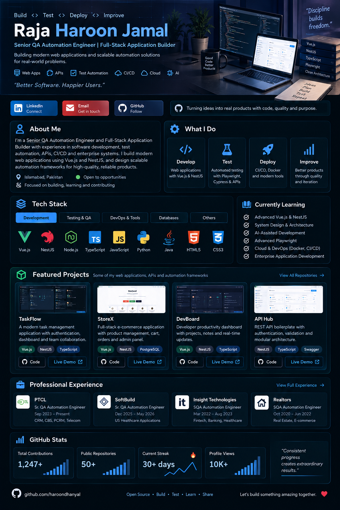
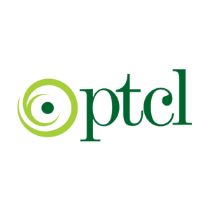

<!-- ====================================================== -->

<!--                PROFESSIONAL PROFILE                    -->

<!-- ====================================================== -->

<p align="center">
  
</p>

<h1 align="center">Hi 👋, I'm Raja Haroon Jamal</h1>

<h3 align="center">
Senior QA Automation Engineer | Full-Stack Application Builder | Vue.js | NestJS | TypeScript | Playwright | API Testing | CI/CD
</h3>

<p align="center">
Building modern web applications, enterprise software, APIs and scalable test automation solutions.
</p>

<p align="center">

<a href="https://github.com/haroondhanyal">
  
</a>

<a href="https://github.com/haroondhanyal?tab=followers">
  
</a>

</p>

<p align="center">

<a href="https://www.linkedin.com/in/haroon-raja-b01210261">
  
</a>

<a href="mailto:rajaharoon320@gmail.com">
  
</a>

<a href="https://github.com/haroondhanyal">
  
</a>

</p>

---

# 👨‍💻 About Me

I am a **Full-Stack Application Developer and Senior QA Automation Engineer** with hands-on experience across **software development, quality engineering, enterprise applications, APIs, CI/CD and product delivery**.

I build modern **web applications and business software** using:

`Vue.js` • `NestJS` • `Node.js` • `TypeScript` • `JavaScript` • `REST APIs`

Alongside software development, I have strong professional experience designing and maintaining scalable automation solutions using:

`Playwright` • `Cypress` • `Selenium` • `Appium` • `Postman` • `JMeter`

My engineering background covers enterprise systems across:

**Telecom • Healthcare • Fintech • Banking • E-commerce • Real Estate • CRM • Billing Systems**

I enjoy working across the complete software lifecycle:

**Requirement → Product Workflow → Architecture → Development → API → Testing → Automation → CI/CD → Release**

---

# 🚀 What I Do

### 💻 Full-Stack Development

* Build modern full-stack web applications.
* Develop responsive frontend applications using **Vue.js**.
* Build scalable backend services using **NestJS**.
* Develop RESTful APIs using **TypeScript and Node.js**.
* Implement reusable frontend components.
* Implement modular backend architecture.
* Develop CRUD-based business applications.
* Integrate frontend applications with backend APIs.
* Implement authentication and authorization workflows.
* Build dashboards and administration portals.
* Develop enterprise-style business workflows.

### 🧪 Quality Engineering

* Build scalable automation frameworks.
* Automate web applications using Playwright.
* Perform API testing and automation.
* Implement Page Object Model architecture.
* Develop data-driven automation frameworks.
* Automate regression and E2E scenarios.
* Perform mobile automation.
* Conduct performance and load testing.
* Integrate automation into CI/CD pipelines.

### 🏢 Enterprise Applications

* CRM systems
* Billing systems
* Customer management platforms
* Telecom applications
* Healthcare systems
* Financial applications
* E-commerce platforms
* Administrative dashboards
* Business management systems

---

# 💻 Software Development

## 🟢 Frontend Engineering

<p>


</p>

### Technologies

* Vue.js
* TypeScript
* JavaScript
* HTML5
* CSS3
* Component-Based Architecture
* Responsive Web Design
* REST API Integration
* Form Validation
* State & Data Management
* Reusable UI Components
* Dashboard Development

### Development Areas

* Business dashboards
* Admin portals
* Data-driven interfaces
* Authentication interfaces
* User management
* Search and filtering
* Forms and validation
* Responsive application layouts
* API-connected frontend applications

---

# 🔴 Backend Engineering

<p>


</p>

### Technologies

* NestJS
* Node.js
* TypeScript
* REST APIs
* Modular Architecture
* Controllers
* Services
* Modules
* DTOs
* Request Validation
* Exception Handling
* Authentication
* Authorization
* CRUD APIs
* Business Logic

### Backend Development

* RESTful service development
* API endpoint design
* Business logic implementation
* Modular backend architecture
* Request / response handling
* Input validation
* Authentication workflows
* Role-based access workflows
* Error handling
* Frontend / backend integration

---

# 🌐 Full-Stack Application Development

My current development focus is building **complete applications**, not only isolated frontend pages or APIs.

Typical architecture:

```text
                     ┌───────────────────────┐
                     │       Vue.js UI       │
                     │   Frontend / Client   │
                     └───────────┬───────────┘
                                 │
                              REST API
                                 │
                     ┌───────────▼───────────┐
                     │        NestJS         │
                     │    Backend / API      │
                     └───────────┬───────────┘
                                 │
                     ┌───────────▼───────────┐
                     │    Business Logic     │
                     │   Data / Services     │
                     └───────────────────────┘
```

### Application Capabilities

* Authentication
* User Management
* Role-Based Access
* CRUD Operations
* Dashboards
* REST APIs
* Search
* Filtering
* Form Validation
* Data Management
* Business Workflows
* Responsive UI
* Error Handling
* API Integration
* Modular Architecture

---

# 🚀 Development Projects

I am actively building **production-style web applications and larger software projects** using modern JavaScript/TypeScript technologies.

My development repositories demonstrate my progression from **Quality Engineering into complete Software Engineering**.

---

## 🌐 Vue.js Web Applications

Building modern frontend applications using:

`Vue.js` `TypeScript` `JavaScript` `HTML` `CSS`

Development areas include:

* Modern dashboards
* Management portals
* Responsive interfaces
* Reusable components
* Dynamic forms
* Search and filtering
* API integrations
* Authentication screens
* Business workflow interfaces
* Data-driven UI

---

## ⚙️ NestJS Backend Applications

Building structured backend applications using:

`NestJS` `Node.js` `TypeScript` `REST API`

Backend projects include concepts such as:

* Controllers
* Services
* Modules
* DTOs
* REST endpoints
* CRUD operations
* Validation
* Authentication
* Authorization
* Error handling
* Business rules
* Modular backend architecture

---

## 🔗 Vue.js + NestJS Full-Stack Applications

Building applications where:

```text
Vue.js Frontend
       ↓
REST API
       ↓
NestJS Backend
       ↓
Application Services
       ↓
Business Data
```

The objective is to build complete software systems covering both **user experience and backend business logic**.

---

# 🧠 Engineering Approach

I approach software engineering from multiple perspectives:

```text
Business Requirement
        ↓
Product Understanding
        ↓
Application Architecture
        ↓
Frontend Development
        ↓
Backend Development
        ↓
REST API Integration
        ↓
Functional Testing
        ↓
Automation
        ↓
CI/CD
        ↓
Release Validation
```

My Quality Engineering background allows me to develop applications while considering:

* Testability
* Reliability
* Edge cases
* Error handling
* User workflows
* API behavior
* Regression risk
* Production readiness

---

# 💼 Professional Experience

<h2>

PTCL — Sr. QA Automation Engineer
</h2>

**September 2023 – Present | Islamabad, Pakistan**

Working across enterprise **CRM, CBS, PCRM and Telecom applications**, with responsibilities spanning quality engineering, requirements, automation, APIs, UAT and release delivery.

### Key Responsibilities

* Lead QA activities for enterprise CRM, CBS and PCRM applications.
* Work with Product Owners, Developers, Operations and business stakeholders.
* Perform requirements analysis for RFCs and enhancements.
* Prepare test strategies, scenarios and test cases.
* Validate customer order-management workflows.
* Validate provisioning and billing workflows.
* Build Playwright automation using JavaScript/TypeScript.
* Implement Page Object Model architecture.
* Develop Data-Driven automation.
* Automate regression scenarios.
* Implement BDD using Cucumber/Gherkin.
* Perform REST API testing using Postman.
* Validate API payloads and business rules.
* Conduct performance testing using JMeter.
* Integrate automation with Jenkins.
* Perform UAT and production validation.
* Manage defects through JIRA.
* Participate in Agile/Scrum ceremonies.
* Support release planning and regression sign-off.
* Perform Scrum Master responsibilities when required.

---

##  SoftBuild — Sr. QA Automation Engineer

**December 2025 – May 2026 | Remote | US Healthcare Projects**

Worked on US healthcare applications with a strong focus on automation architecture and end-to-end quality engineering.

### Key Responsibilities

* Developed Playwright automation frameworks from scratch.
* Used JavaScript and TypeScript.
* Implemented Page Object Model.
* Automated UI and API scenarios.
* Automated Smoke, Regression and E2E workflows.
* Tested healthcare and patient workflows.
* Validated REST APIs.
* Managed environment-specific configurations.
* Configured Bitbucket Pipelines.
* Integrated Allure Reports.
* Investigated automation failures.
* Performed root-cause analysis.
* Collaborated with development and product teams.

---

##  Insight Technologies — SQA Automation Engineer

**March 2022 – August 2023 | Rawalpindi, Pakistan**

Worked across **Fintech, Banking, Healthcare, EHR/EMR and Mobile applications**.

### Responsibilities

* Functional Testing
* Regression Testing
* Integration Testing
* Playwright Automation
* Cypress Automation
* Appium Mobile Automation
* API Testing
* Performance Testing
* JMeter
* Allure Reporting
* Git/GitHub
* Cross-Browser Testing
* Agile/Scrum

---

##  Realtors — SQA Automation Engineer

**October 2020 – June 2022 | Islamabad, Pakistan**

Worked across:

* Real Estate
* E-commerce
* Healthcare
* Fintech
* Web applications

Responsibilities included functional testing, automation, API validation, performance testing, UAT and production validation.

---

# 🏢 Enterprise & Product Projects

## 📡 PTCL — Telecom Enterprise Systems

### 💳 CBS — Converged Billing System

* Enterprise telecom billing
* Customer lifecycle management
* Business-rule validation
* Integration testing
* End-to-End testing
* API validation
* Release validation

### 🌐 CRM — Wireline Portal

* Customer order management
* Service provisioning
* Product workflows
* End-to-End customer journeys
* Playwright automation
* API testing
* Regression automation
* Production validation

### 👥 One Window PCRM

* Customer relationship workflows
* Operational workflows
* Requirement analysis
* Functional testing
* End-to-End validation
* Defect management
* Release validation

---

# 🏥 Healthcare Engineering

### EHR / EMR Systems

* Patient workflows
* Healthcare business workflows
* UI automation
* API automation
* Regression automation
* POM architecture
* CI/CD
* Allure reporting
* UAT validation
* Production validation

### 🤖 AI / LLM Applications

* AI application testing
* LLM response validation
* Prompt scenario testing
* Business response validation
* Regression testing of AI workflows
* Product and engineering collaboration

---

# 💳 Fintech & Banking

Experience across:

* Banking web applications
* Banking mobile applications
* Financial workflows
* Trading workflows
* REST APIs
* Integration testing
* Playwright
* Cypress
* Appium
* JMeter

---

# 🏠 Real Estate & E-commerce

Experience across:

* Real estate platforms
* Customer-facing applications
* E-commerce applications
* Business workflow testing
* Cross-browser validation
* Regression automation
* Performance testing
* UAT
* Production validation

---

# 🛠️ Complete Technical Stack

## 💻 Software Development

<p>

</p>

* Vue.js
* NestJS
* Node.js
* TypeScript
* JavaScript
* Python
* Java
* HTML5
* CSS3

---

## 🎭 Test Automation

* Playwright
* Cypress
* Selenium WebDriver
* Appium
* UI Automation
* Mobile Automation
* Cross-Browser Automation
* End-to-End Automation
* Regression Automation
* Page Object Model
* Data-Driven Testing

---

# 🔌 APIs

* REST API Development
* REST API Testing
* Postman
* REST Assured
* Swagger / OpenAPI
* JSON
* Request Validation
* Response Validation
* JSON Schema Validation
* API Integration Testing

---

# 📱 Mobile Engineering & Testing

* Appium
* Java
* Android
* iOS
* XCUITest
* Xcode
* Cross-Platform Testing

---

# ⚡ Performance Engineering

* Apache JMeter
* Load Testing
* Stress Testing
* Performance Testing
* API Performance Testing
* Response-Time Analysis
* Throughput Analysis

---

# 🥒 BDD & Architecture

* BDD
* Gherkin
* Cucumber
* Page Object Model
* Data-Driven Testing
* Modular Architecture
* Component-Based Architecture
* Test Architecture
* Test Scenario Design

---

# 🔄 DevOps & CI/CD

<p>

</p>

* Git
* GitHub
* Bitbucket
* Docker
* Jenkins
* Azure DevOps
* Bitbucket Pipelines
* CI/CD Automation
* Environment Configuration
* Automated Regression Execution

---

# 📊 Test Management & Engineering Tools

* JIRA
* Testomat.io
* Allure Report
* Cypress Dashboard
* Swagger
* Postman
* GitHub
* Bitbucket
* Jenkins

---

# 🧪 Testing Expertise

| Testing Area          | Experience |
| --------------------- | ---------- |
| Functional Testing    | ✅          |
| Regression Testing    | ✅          |
| Smoke Testing         | ✅          |
| Sanity Testing        | ✅          |
| Integration Testing   | ✅          |
| System Testing        | ✅          |
| End-to-End Testing    | ✅          |
| UI Testing            | ✅          |
| API Testing           | ✅          |
| Mobile Testing        | ✅          |
| Cross-Browser Testing | ✅          |
| Exploratory Testing   | ✅          |
| UAT                   | ✅          |
| Production Validation | ✅          |
| Performance Testing   | ✅          |
| Load Testing          | ✅          |
| Stress Testing        | ✅          |
| AI / LLM Testing      | ✅          |

---

# 🏢 Domain Expertise

`Telecom`

`CRM`

`Billing Systems`

`Healthcare`

`EHR / EMR`

`Fintech`

`Banking`

`E-commerce`

`Real Estate`

`Enterprise Applications`

---

# 📚 Software Engineering & Agile

* SDLC
* STLC
* Agile
* Scrum
* Sprint Planning
* Daily Stand-ups
* Backlog Refinement
* Sprint Reviews
* Retrospectives
* Release Planning
* Requirement Analysis
* Risk Identification
* UAT Coordination
* Regression Sign-off
* Scrum Master Responsibilities

---

# 📄 Engineering Documentation

* Requirements
* User Stories
* Acceptance Criteria
* Test Plans
* Test Scenarios
* Test Cases
* Test Data
* Defect Reports
* Requirement Traceability
* API Documentation
* Test Execution Reports
* QA Process Documentation

---

# 🏆 Key Achievements

### 💻 Software Engineering

* 🚀 Expanded engineering expertise into **Full-Stack Application Development**.
* 🟢 Building modern frontend applications using **Vue.js**.
* 🔴 Building backend applications and REST APIs using **NestJS**.
* ⚡ Developing applications using **TypeScript and JavaScript**.
* 🔗 Building integrated frontend/backend application workflows.
* 🏢 Applying enterprise-domain knowledge to software projects.
* 🤖 Using AI-assisted development workflows for application development.

### 🧪 Quality Engineering

* 🎭 Built scalable Playwright automation frameworks.
* 🔌 Developed UI and API automation.
* 🏢 Led QA activities for enterprise CRM and billing systems.
* 🏥 Delivered automation solutions for healthcare applications.
* 🤖 Tested AI / LLM-powered applications.
* 🔄 Integrated automation into Jenkins and Bitbucket pipelines.
* 📊 Implemented Allure-based reporting.
* ⚡ Reduced repetitive manual regression effort.
* 📱 Worked across Web, Android and iOS applications.
* 👥 Supported UAT and production releases.

---

# 🎓 Certifications

| Certification                      | Issuer           | Year |
| ---------------------------------- | ---------------- | ---: |
| Agile Project Management           | Google           | 2024 |
| Web & Mobile Testing with Selenium | Coursera         | 2024 |
| Test Automation with Cypress       | 10Pearls         | 2024 |
| SQA Automation Bootcamp            | Contour Software | 2023 |

---

# 📈 GitHub Stats

<p align="center">


</p>

<p align="center">


</p>

---

# 💻 Development & Engineering Technologies

<p align="center">


</p>

---

# 🌱 Currently Building & Learning

### 💻 Development

* Advanced Vue.js
* NestJS Backend Architecture
* Advanced TypeScript
* Full-Stack Application Development
* REST API Design
* Authentication & Authorization
* Enterprise Application Architecture
* System Design
* Database-Driven Applications

### 🧪 Quality Engineering

* Advanced Playwright
* API Automation
* Modern Test Architecture
* Performance Engineering
* CI/CD Quality Engineering

### 🤖 AI Engineering

* AI-Assisted Software Development
* AI-Assisted Testing
* LLM Application Testing
* AI Integration Concepts

---

# 🎯 Current Engineering Focus

```text
┌──────────────────────────────────────────────┐
│           FULL-STACK DEVELOPMENT             │
│                                              │
│     Vue.js + NestJS + TypeScript + APIs      │
└──────────────────────┬───────────────────────┘
                       │
                       ▼
┌──────────────────────────────────────────────┐
│             QUALITY ENGINEERING              │
│                                              │
│ Playwright + API + Mobile + Performance      │
└──────────────────────┬───────────────────────┘
                       │
                       ▼
┌──────────────────────────────────────────────┐
│                DEVOPS / CI/CD                │
│                                              │
│      Git + Docker + Jenkins + Pipelines      │
└──────────────────────────────────────────────┘
```

---

# 💡 Engineering Philosophy

### Build it. Test it. Automate it. Ship it.

My goal is not limited to writing application code or writing automated tests.

I aim to understand the **complete engineering lifecycle**:

```text
IDEA
 ↓
REQUIREMENTS
 ↓
PRODUCT DESIGN
 ↓
SOFTWARE ARCHITECTURE
 ↓
FRONTEND
 ↓
BACKEND
 ↓
APIs
 ↓
DATABASE / DATA
 ↓
TESTING
 ↓
AUTOMATION
 ↓
CI/CD
 ↓
UAT
 ↓
PRODUCTION
```

This combination allows me to approach applications from the perspectives of both a **developer and quality engineer**.

---

# 🤝 Let's Connect

<p align="center">

<a href="https://www.linkedin.com/in/haroon-raja-b01210261">

</a>

<a href="mailto:rajaharoon320@gmail.com">

</a>

<a href="https://github.com/haroondhanyal">

</a>

</p>

---

<h3 align="center">
💻 Building Software • 🧪 Automating Quality • 🚀 Delivering Better Products
</h3>

<p align="center">
Thanks for visiting my profile! Feel free to explore my software development and QA automation projects.
</p>
